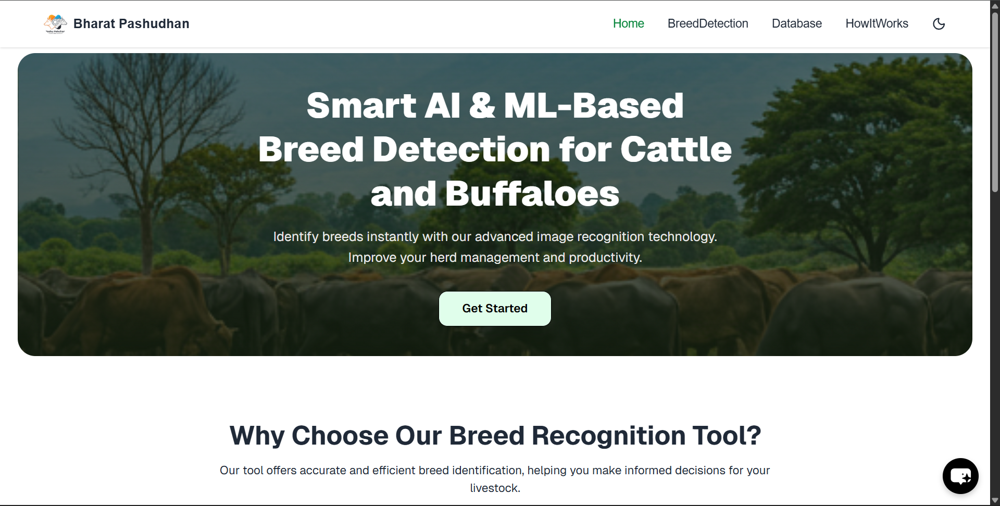
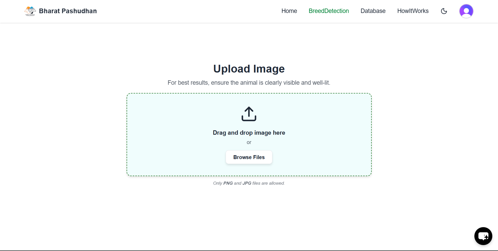
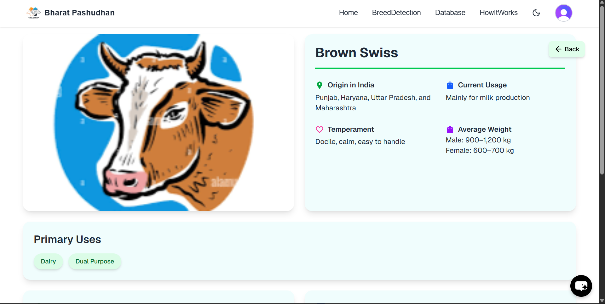

# 🐄 PashuGyan – ML-based Livestock Breed Identification

🔗 Live Demo: https://pashugyan.vercel.app  

---

## 🚀 Overview

PashuGyan is a full-stack web application that enables users to identify **cow and buffalo breeds** using image-based machine learning.

The platform allows users to upload an image and get:
- Predicted breed
- Confidence score
- Detailed breed insights

---

## ✨ Features

- 📸 Image upload for livestock breed detection  
- 🤖 ML model integration for prediction  
- 📊 Confidence score & breed details  
- ⚡ Fast and responsive UI  
- 🔗 API-based architecture for seamless communication  

---

## 🛠 Tech Stack

**Frontend**
- Next.js  
- React.js  
- Tailwind CSS  

**Backend**
- Node.js  
- Express.js  
- RESTful APIs  

**ML Integration**
- Image classification model (integrated via API)

---

## 🧠 How It Works

1. User uploads an image of livestock  
2. Image is sent to backend via API  
3. ML model processes the image  
4. System returns:
   - Breed prediction  
   - Confidence score  
   - Additional breed insights  

---

## 📸 Screenshots

<!-- Add your screenshots here -->




---

## ⚙️ Setup & Installation

```bash
git clone https://github.com/tusharBHO/pashugyan.git
cd pashugyan
npm install
npm run dev
